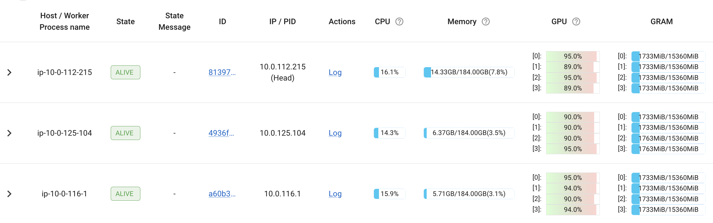

# 03. Ray Train with FSDP (Fully Sharded Data Parallel)

## 🚀 For Large Models

This module shows how **ridiculously easy** it is to switch from DDP to FSDP with Ray Train. The change? **ONE PARAMETER** in `prepare_model()`.

## 📚 Files in This Directory

| File | Description | Level | Best For |
|------|-------------|-------|----------|
| **train_ray_fsdp.py** | Simple high-level FSDP | Beginner | Learning, quick start |
| **train_ray_fsdp2.py** | Advanced low-level FSDP2 | Advanced | Production, fine-tuning |

**Two implementations:**
- **train_ray_fsdp.py** - Simple 1-parameter FSDP (recommended for learning)
- **train_ray_fsdp2.py** - Advanced FSDP with CPU offload, mixed precision, and memory profiling (see details at end of this README)

Both use the **same CIFAR-10 dataset and VisionTransformer model** for easy comparison!

**When to use:** Your model doesn't fit on a single GPU, or you want maximum memory efficiency for large models.

## DDP vs FSDP: The Memory Story

### Data Parallel (DDP)
```
GPU 0: [Full Model Copy] + [Data Batch 0]
GPU 1: [Full Model Copy] + [Data Batch 1]
GPU 2: [Full Model Copy] + [Data Batch 2]
GPU 3: [Full Model Copy] + [Data Batch 3]

Memory per GPU: Full model + gradients + optimizer states
Total Model Memory: 4x (redundant!)
```

### Fully Sharded Data Parallel (FSDP)
```
GPU 0: [Model Shard 0] + [Data Batch 0]
GPU 1: [Model Shard 1] + [Data Batch 1]
GPU 2: [Model Shard 2] + [Data Batch 2]
GPU 3: [Model Shard 3] + [Data Batch 3]

Memory per GPU: 1/4 model + gradients + optimizer states
Total Model Memory: 1x (efficient!)
```

## The One-Parameter Change

### DDP Version
```python
model = ray.train.torch.prepare_model(model)
```

### FSDP Version
```python
model = ray.train.torch.prepare_model(model, parallel_strategy="fsdp")
```

**That's literally it!** Ray handles:
- Model sharding across GPUs
- Gradient sharding
- All-gather operations during forward pass
- Reduce-scatter operations during backward pass
- Optimizer state sharding

## When to Use FSDP

### Use FSDP When:
- ✅ Model doesn't fit on a single GPU
- ✅ Training models with billions of parameters (LLMs, large vision models)
- ✅ Want to train larger models with limited GPU memory
- ✅ Memory is the bottleneck, not compute
- ✅ You have multiple GPUs available

### Stick with DDP When:
- ❌ Model comfortably fits on a single GPU
- ❌ Communication overhead would hurt performance
- ❌ You have very fast GPUs but slower interconnect
- ❌ Batch size is already very small

## Memory Savings Example

**Training a 1B parameter model (assuming fp32):**

### DDP (4 GPUs):
```
Model: 1B params × 4 bytes = 4 GB
Gradients: 4 GB
Optimizer (Adam): 8 GB (2 states)
---
Per GPU: ~16 GB
Total: ~64 GB
```

### FSDP (4 GPUs):
```
Model shard: 1B/4 params × 4 bytes = 1 GB
Gradient shard: 1 GB
Optimizer shard: 2 GB
---
Per GPU: ~4 GB
Total: ~16 GB (4x savings!)
```

## Running the Example

### Prerequisites
```bash
# Install dependencies
pip install -r requirements.txt

# Requires PyTorch 2.0+ for native FSDP support
python -c "import torch; print(f'PyTorch: {torch.__version__}')"
```

### Basic Training
```bash
# Train with all available GPUs
python train_ray_fsdp.py

# Train with specific configuration
python train_ray_fsdp.py --epochs 20 --num-workers 4

# Compare with DDP
cd ../02-ray-train-ddp
python train_ray_ddp.py --epochs 20 --num-workers 4
```

### Expected Output
```
============================================================
Ray Train FSDP Configuration
============================================================
Number of workers: 4

NOTE: FSDP shards model parameters across 4 workers
      Each worker uses ~1/4 of the model memory
============================================================

Model wrapped with FSDP - parameters are sharded across GPUs!

Epoch 1/10
Results:
  Accuracy: 0.5678 (56.78%)
...
```

## Actual Training Results

**VisionTransformer on CIFAR-10 (10 epochs, 12 workers across 3 nodes):**

- **Training Time**: 4 minutes 12 seconds (252 seconds)
- **Final Accuracy**: 60.19%
- **Configuration**: 12 workers (3 nodes × 4 GPUs), batch_size=42 per worker (504 global)
- **Storage**: `/mnt/cluster_storage/cifar10_fsdp_b3f34120/`
- **Memory per GPU**: ~1/12 of full model (sharded across 12 workers)

### Ray Dashboard - FSDP Training with Model Sharding



**What you're seeing in the Ray Dashboard:**
- **Multi-node FSDP training** - Ray orchestrates parameter sharding across 3 nodes
- **Memory efficiency** - Each worker only holds 1/12 of the model parameters
- **Automatic coordination** - Ray handles all-gather and reduce-scatter operations
- **Same Ray infrastructure** - FSDP uses the same Ray Train framework as DDP
- **Seamless scaling** - One parameter change (`parallel_strategy="fsdp"`) enables memory-efficient training

**Performance Comparison:**
- **1.9x faster** than vanilla DDP (4 GPUs, 1 node): 4:12 vs 7:55
- **Nearly identical to Ray Train DDP**: 4:12 vs 4:01 (minimal FSDP overhead)
- **Better accuracy**: 60.19% vs 57.62% (vanilla DDP)
- **Memory efficiency**: Each GPU holds only 1/12 of model parameters

**Key Insight**: FSDP has minimal overhead for this model size. The memory savings become critical for models that don't fit on a single GPU!

## Code Walkthrough

The code is **99% identical** to the DDP version. Here's the complete diff:

```diff
  # Create model
  model = VisionTransformer(...)

  # Prepare model
- model = ray.train.torch.prepare_model(model)
+ model = ray.train.torch.prepare_model(model, parallel_strategy="fsdp")

  # Everything else is IDENTICAL!
  optimizer = torch.optim.AdamW(model.parameters(), ...)
  for epoch in range(epochs):
      # ... training loop ...
```

That's the entire change! The training loop, data loading, metric reporting - all stay the same.

## How FSDP Works Under the Hood

### Forward Pass:
1. Each GPU stores only its shard of parameters
2. Before computation: **All-gather** full layer parameters
3. Compute forward pass with full parameters
4. After computation: **Discard** gathered parameters (keep only shard)

### Backward Pass:
1. Each GPU computes gradients for full layer
2. After computation: **Reduce-scatter** gradients to shards
3. Each GPU updates only its parameter shard

### Result:
- ✅ Same computation as DDP (uses full parameters during forward/backward)
- ✅ Much lower memory (stores only sharded parameters)
- ⚠️ More communication (all-gather + reduce-scatter per layer)

## Performance Considerations

### Communication Overhead
FSDP has more communication than DDP:
- **DDP**: One all-reduce after backward pass
- **FSDP**: All-gather per layer (forward) + reduce-scatter per layer (backward)

**Mitigation:**
- Use fast interconnect (NVLink, InfiniBand)
- Increase batch size to amortize communication
- Use mixed precision (less data to transfer)

### Memory vs Communication Trade-off

```
Small Models (<1B params):
  DDP: ✅ Lower communication, ✅ fits in memory
  FSDP: ❌ Extra communication overhead

Large Models (>10B params):
  DDP: ❌ Doesn't fit in memory
  FSDP: ✅ Makes training possible!
```

## Advanced FSDP Configuration

Ray Train uses sensible defaults, but you can customize:

```python
from ray.train.torch import TorchConfig

torch_config = TorchConfig(
    backend="nccl",  # Communication backend
    fsdp_config={
        "sharding_strategy": "FULL_SHARD",  # or "SHARD_GRAD_OP", "NO_SHARD"
        "cpu_offload": False,  # Offload to CPU for even larger models
        "mixed_precision": True,  # Use fp16/bf16 for faster training
    }
)

trainer = TorchTrainer(
    ...,
    torch_config=torch_config
)
```

### Sharding Strategies:

1. **FULL_SHARD** (default):
   - Shard model, gradients, and optimizer states
   - Maximum memory savings

2. **SHARD_GRAD_OP**:
   - Shard gradients and optimizer states only
   - Keep full model on each GPU
   - Less memory savings, less communication

3. **NO_SHARD**:
   - Equivalent to DDP (no sharding)
   - Used for comparison

## Real-World Use Cases

### Training Large Language Models
```python
# GPT-3 style model (175B parameters)
# Would require ~700GB memory with DDP
# With FSDP on 64 GPUs: ~11GB per GPU

model = GPT3Model(n_params=175_000_000_000)
model = ray.train.torch.prepare_model(model, parallel_strategy="fsdp")
# Now trainable on 64 A100 GPUs!
```

### Training Large Vision Models
```python
# ViT-Giant (2B parameters)
# Would require ~8GB memory with DDP
# With FSDP on 8 GPUs: ~1GB per GPU

model = VisionTransformer(hidden_dim=6144, num_layers=48)
model = ray.train.torch.prepare_model(model, parallel_strategy="fsdp")
```

## Debugging Tips

### Check Memory Usage
```python
import torch
if local_rank == 0:
    print(f"GPU memory: {torch.cuda.memory_allocated() / 1e9:.2f} GB")
```

### Verify Sharding
```python
# FSDP wraps each layer - check the model structure
if local_rank == 0:
    print(model)  # Should see FSDP wrapper around modules
```

### Compare DDP vs FSDP
Run both and compare:
1. Memory usage per GPU
2. Training throughput (samples/sec)
3. Communication overhead

## Combining FSDP with Other Techniques

### FSDP + Mixed Precision
```python
from torch.cuda.amp import autocast, GradScaler

scaler = GradScaler()
model = ray.train.torch.prepare_model(model, parallel_strategy="fsdp")

for inputs, targets in dataloader:
    with autocast():
        outputs = model(inputs)
        loss = criterion(outputs, targets)

    scaler.scale(loss).backward()
    scaler.step(optimizer)
    scaler.update()
```

### FSDP + Gradient Accumulation
```python
accumulation_steps = 4
model.train()

for i, (inputs, targets) in enumerate(dataloader):
    outputs = model(inputs)
    loss = criterion(outputs, targets) / accumulation_steps
    loss.backward()

    if (i + 1) % accumulation_steps == 0:
        optimizer.step()
        optimizer.zero_grad()
```

### FSDP + CPU Offloading
```python
# For REALLY large models, offload to CPU
model = ray.train.torch.prepare_model(
    model,
    parallel_strategy="fsdp",
    fsdp_config={"cpu_offload": True}
)
# Even larger models, but slower training
```

## Comparison Summary

| Aspect | DDP | FSDP |
|--------|-----|------|
| Model memory per GPU | Full model | 1/N of model |
| Gradient memory | Full gradients | 1/N of gradients |
| Optimizer memory | Full state | 1/N of state |
| Communication | All-reduce (1x) | All-gather + reduce-scatter (Nx) |
| Peak memory | High | Low |
| Speed (small models) | Faster | Slower (overhead) |
| Speed (large models) | N/A (OOM) | Enables training |
| Code changes with Ray | `prepare_model(model)` | `prepare_model(model, parallel_strategy="fsdp")` |

## What's Next?

You've now seen the full progression:
1. **Single Machine** - Baseline PyTorch training
2. **Vanilla DDP** - Manual distributed setup (painful!)
3. **Ray Train DDP** - Clean distributed training (easy!)
4. **Ray Train FSDP** - Memory-efficient training (one parameter!)

**Next steps:**
- Try training larger models with FSDP
- Experiment with mixed precision training
- Scale to multiple nodes
- Integrate with Ray Tune for hyperparameter optimization

## Further Reading

- [Ray Train Documentation](https://docs.ray.io/en/latest/train/train.html)
- [PyTorch FSDP Tutorial](https://pytorch.org/tutorials/intermediate/FSDP_tutorial.html)
- [Scaling PyTorch models with FSDP](https://engineering.fb.com/2021/07/15/open-source/fsdp/)

---

# Advanced Option: train_ray_fsdp2.py

## Overview

For users who need **fine-grained control** over FSDP configuration, `train_ray_fsdp2.py` provides an advanced implementation following the official Ray documentation pattern with low-level FSDP2 APIs.

### When to Use train_ray_fsdp2.py

Use the advanced version if you need:

✅ **Full control** over FSDP configuration (device mesh, sharding strategies)
✅ **CPU offload** for training even larger models (saves GPU memory)
✅ **Mixed precision** for faster training and reduced memory
✅ **Selective layer sharding** (shard only specific layers like encoder blocks)
✅ **Memory profiling** to analyze and optimize memory usage
✅ **FSDP-aware checkpointing** for proper distributed checkpoint handling
✅ **Explicit device management** following PyTorch best practices

**Note:** `train_ray_fsdp2.py` uses the **same CIFAR-10 dataset and VisionTransformer model** as `train_ray_fsdp.py`, making it easy to compare simple vs advanced implementations.

---

## Quick Start with train_ray_fsdp2.py

### Basic Run (Same as Simple Version)
```bash
python train_ray_fsdp2.py --epochs 5 --num-workers 4
```

### With Memory Optimization
```bash
# Enable CPU offload (for very large models)
python train_ray_fsdp2.py --epochs 5 --num-workers 4 --cpu-offload

# Enable mixed precision (faster training)
python train_ray_fsdp2.py --epochs 10 --num-workers 4 --mixed-precision

# Both (maximum memory savings)
python train_ray_fsdp2.py --epochs 10 --cpu-offload --mixed-precision

# Full configuration with profiling
python train_ray_fsdp2.py \
    --epochs 10 \
    --num-workers 4 \
    --batch-size 64 \
    --lr 0.001 \
    --cpu-offload \
    --mixed-precision \
    --checkpoint-freq 2 \
    --profile-dir ./profiles
```

---

## Key Differences: Simple vs Advanced

| Feature | train_ray_fsdp.py | train_ray_fsdp2.py |
|---------|-------------------|-------------------|
| **API Level** | High-level (1 line) | Low-level (explicit) |
| **Dataset/Model** | CIFAR-10 / ViT | CIFAR-10 / ViT (same!) |
| **FSDP Config** | Automatic | Fully configurable |
| **CPU Offload** | ❌ | ✅ `--cpu-offload` |
| **Mixed Precision** | ❌ | ✅ `--mixed-precision` |
| **Memory Profiling** | ❌ | ✅ PyTorch profiler |
| **Checkpoint** | Basic | FSDP-aware |
| **Device Mesh** | Automatic | Explicit configuration |
| **Selective Sharding** | No | Yes (encoder blocks) |
| **Lines of Code** | ~340 | ~600 |

---

## Advanced Features Explained

### 1. CPU Offload

**What:** Stores sharded parameters on CPU, transfers to GPU during computation
**When:** Model too large to fit in GPU memory
**Trade-off:** Saves GPU memory but adds CPU↔GPU transfer overhead
**Usage:** `--cpu-offload`

**Memory savings example:**
- Without: ~8 GB GPU per worker
- With CPU offload: ~2-4 GB GPU per worker
- Cost: ~10-20% slower training

### 2. Mixed Precision

**What:** Uses fp16/bf16 for activations and computations
**When:** You have tensor cores (V100, A100, RTX GPUs)
**Trade-off:** Faster training, less memory, minimal accuracy loss
**Usage:** `--mixed-precision`

**Performance example:**
- Without: 100 samples/sec
- With mixed precision: 150-200 samples/sec (1.5-2x faster)
- Memory: ~50% reduction in activation memory

### 3. Reshard After Forward

**What:** Frees all-gathered weights immediately after forward pass
**When:** Always enabled by default for maximum memory efficiency
**Trade-off:** Reduces peak memory during backward pass
**Usage:** Enabled by default, disable with `--no-reshard` if you have plenty of memory

### 4. Memory Profiling

**What:** Exports detailed memory usage timeline using PyTorch profiler
**Output:** HTML file showing memory usage over time
**Usage:** `--profile-dir ./profiles`

After training, check:
```bash
./profiles/cifar10_fsdp2_*_rank0_memory_profile.html
```

Use it to:
- Identify memory bottlenecks
- Optimize batch size
- Choose between CPU offload and mixed precision
- Debug OOM errors

### 5. Selective Layer Sharding

**What:** Only shard specific layers (e.g., encoder blocks in Vision Transformer)
**Why:** Balance memory reduction against communication overhead
**How:** Automatically applied in `train_ray_fsdp2.py`

```python
# Shard only encoder blocks (where most parameters are)
for block in model.encoder.layers:
    fully_shard(block, mesh=mesh, ...)

# Then shard entire model
model = fully_shard(model, mesh=mesh, ...)
```

---

## Configuration Examples

### Maximum Memory Savings (for very large models)
```bash
python train_ray_fsdp2.py \
    --epochs 10 \
    --num-workers 8 \
    --batch-size 32 \
    --cpu-offload \
    --mixed-precision \
    --checkpoint-freq 1
```

### Maximum Speed (when memory is not an issue)
```bash
python train_ray_fsdp2.py \
    --epochs 10 \
    --num-workers 8 \
    --batch-size 128 \
    --mixed-precision \
    --no-reshard
```

### Debugging Memory Issues
```bash
python train_ray_fsdp2.py \
    --epochs 2 \
    --num-workers 4 \
    --batch-size 64 \
    --profile-dir ./memory_profiles
```

### Production Training
```bash
python train_ray_fsdp2.py \
    --epochs 50 \
    --num-workers 16 \
    --batch-size 64 \
    --lr 0.0001 \
    --mixed-precision \
    --checkpoint-freq 5 \
    --profile-dir /mnt/storage/profiles
```

---

## Troubleshooting Advanced Features

### OOM (Out of Memory) Error

**Step 1:** Enable mixed precision
```bash
python train_ray_fsdp2.py --mixed-precision
```

**Step 2:** Enable CPU offload
```bash
python train_ray_fsdp2.py --cpu-offload --mixed-precision
```

**Step 3:** Reduce batch size
```bash
python train_ray_fsdp2.py --cpu-offload --mixed-precision --batch-size 32
```

**Step 4:** Profile memory
```bash
python train_ray_fsdp2.py --profile-dir ./profiles --epochs 1
# Check the HTML file to identify memory peaks
```

### Training is Slow

**Option 1:** Disable CPU offload if not needed
```bash
python train_ray_fsdp2.py --mixed-precision  # Remove --cpu-offload
```

**Option 2:** Disable reshard after forward
```bash
python train_ray_fsdp2.py --mixed-precision --no-reshard
```

**Option 3:** Increase batch size
```bash
python train_ray_fsdp2.py --mixed-precision --batch-size 128
```

---

## Memory Usage Comparison

**VisionTransformer (12 layers, 384 hidden dim) on 4 GPUs:**

| Configuration | GPU Memory per Worker | Total GPU Memory |
|--------------|----------------------|------------------|
| train_ray_fsdp.py (default) | ~8 GB | ~32 GB |
| train_ray_fsdp2.py (default) | ~8 GB | ~32 GB |
| train_ray_fsdp2.py + mixed_precision | ~4 GB | ~16 GB |
| train_ray_fsdp2.py + cpu_offload | ~2-3 GB | ~8-12 GB |
| train_ray_fsdp2.py + both | ~1-2 GB | ~4-8 GB |

---

## Choosing Between Simple and Advanced

### Use train_ray_fsdp.py (Simple) when:
- ✅ You're learning FSDP
- ✅ Quick prototyping
- ✅ Model fits in GPU memory
- ✅ Default configuration works fine
- ✅ Don't need custom settings

### Use train_ray_fsdp2.py (Advanced) when:
- ✅ Training very large models (billions of parameters)
- ✅ Need CPU offload to fit model in memory
- ✅ Want to optimize memory usage
- ✅ Need memory profiling
- ✅ Production deployment with specific requirements
- ✅ Following Ray's official FSDP documentation patterns

---

## Command-Line Options (train_ray_fsdp2.py)

```
--epochs INT              Number of training epochs (default: 5)
--batch-size INT          Batch size per worker (default: 64)
--lr FLOAT               Learning rate (default: 0.001)
--num-workers INT        Number of workers (default: number of GPUs)

FSDP Configuration:
--cpu-offload            Enable CPU offload (reduces GPU memory)
--mixed-precision        Enable mixed precision training
--no-reshard             Disable reshard after forward (increases memory)
--checkpoint-freq INT    Save checkpoint every N epochs (default: 5)
--profile-dir PATH       Directory for profiler output (default: /tmp)
```

---

## Summary

Both `train_ray_fsdp.py` and `train_ray_fsdp2.py` demonstrate FSDP with Ray Train:

- **train_ray_fsdp.py**: Perfect for learning and quick start (1 parameter change!)
- **train_ray_fsdp2.py**: Full control for production use with advanced optimizations

Start with the simple version, then move to the advanced version when you need fine-grained control over memory optimization, profiling, or production deployment.

**Both use the same CIFAR-10 dataset and VisionTransformer model for easy comparison!**
