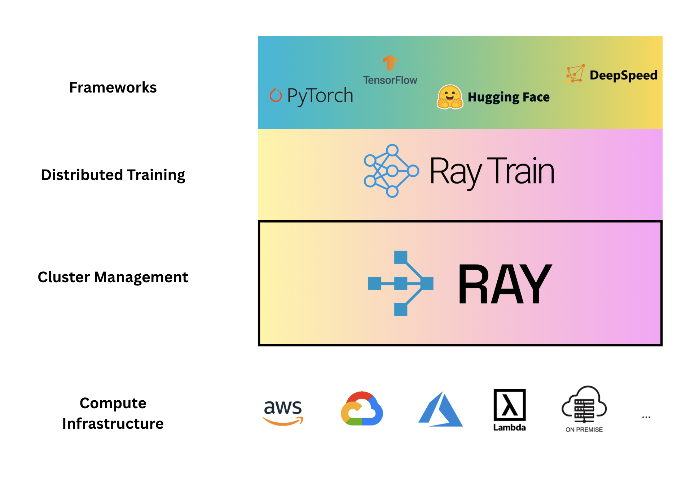

# 02. Distributed Training with PyTorch and Ray

Master distributed training for deep learning models at scale - from single machine to multi-node, from DDP to FSDP.

## Overview

This module teaches you **distributed training the right way** through a clear learning progression. You'll see:
1. How painful vanilla PyTorch DDP is (and why you shouldn't use it)
2. How Ray Train eliminates 90% of the boilerplate
3. How to switch from DDP to FSDP with one parameter change

---

## Getting Started with Anyscale (Recommended)

The easiest way to get started is using Anyscale Platform, which provides a ready-to-use Ray cluster:

1. **Create a free account** at [anyscale.com](https://console.anyscale.com/register/v2)
2. **Create a workspace** - Your Ray cluster will be automatically provisioned and ready to use
3. **Clone this repository** in your workspace
4. **Start training** - The cluster is already up and running with GPUs and Ray resources

This eliminates the need for local setup and gives you immediate access to multi-GPU distributed training capabilities.

**For local development**, continue with the Installation section below.

---

## 📊 Slide Deck

**[→ View Slides: Distributed Training with Ray](https://www.canva.com/design/DAG2W25BKAw/yXl48lXeg0g60Rf_1RUXrw/view)**

Comprehensive presentation covering:
- Distributed training fundamentals (DDP vs FSDP)
- Ray Train architecture and design
- Code comparisons and best practices
- Performance benchmarks and scaling strategies
- Real-world examples and debugging tips


*Ray Train integrates seamlessly with popular frameworks (PyTorch, TensorFlow, Hugging Face, DeepSpeed) and runs on any infrastructure (AWS, GCP, Azure, Lambda, On-Premise)*

---

### 🎯 Training Setup

```
📊 Model:  VisionTransformer (ViT)
📦 Dataset: CIFAR-10 (50k images, 10 classes)
🔧 Task:    Image Classification
```

### 🚀 Learning Progression

```
Step 1: Single Machine    →  Baseline (1 GPU)
        🖥️ train_single_machine.py

Step 2: Vanilla DDP       →  Manual Setup (4 GPUs, ~350 lines)
        ⚠️ train_ddp.py

Step 3: Ray Train DDP     →  Automated (4+ GPUs, ~250 lines)
        ✅ train_ray_ddp.py

Step 4: Ray Train FSDP    →  Memory Efficient (4+ GPUs, 1 parameter change!)
        ⚡ train_ray_fsdp.py

Step 5: Ray Train FSDP2   →  Advanced Control (CPU offload, mixed precision)
        🎛️ train_ray_fsdp2.py
```

**Result**: From 350 lines of manual boilerplate → 250 lines of automated training → Same code + `parallel_strategy="fsdp"` for memory efficiency!

## Learning Path

Follow the modules in order for the best learning experience:

### 01. Vanilla PyTorch DDP (⚠️ Learn but Don't Use)
**Purpose**: Understand the pain points of manual distributed training

```bash
cd 01-vanilla-pytorch-ddp
python train_single_machine.py  # Baseline
python train_ddp.py              # The painful way
```

**What you'll see:**
- 9 manual boilerplate steps
- 350+ lines of setup code
- Easy to miss critical steps
- No fault tolerance
- Complex multi-node setup

**Key Lesson**: *This is why Ray Train exists!*

### 02. Ray Train DDP (✅ Use This)
**Purpose**: See how Ray simplifies distributed training

```bash
cd 02-ray-train-ddp
python train_ray_ddp.py --num-workers 4
```

**What you'll learn:**
- Only 3 changes from single-machine code
- 250 lines vs 350+ (28% less code)
- Automatic resource management
- Built-in fault tolerance
- Easy multi-node scaling

**Key Lesson**: *Same performance, 10x simpler code*

### 03. Ray Train FSDP (🚀 For Large Models)
**Purpose**: Scale to models that don't fit on a single GPU

```bash
cd 03-ray-train-fsdp
python train_ray_fsdp.py --num-workers 4
```

**What you'll learn:**
- ONE parameter change from DDP
- 4-100x memory savings
- Train billion-parameter models
- Memory vs communication trade-offs

**Key Lesson**: *Switching strategies is trivial with Ray*

## Quick Comparison

| Aspect | Vanilla DDP | Ray DDP | Ray FSDP |
|--------|-------------|---------|----------|
| **Code complexity** | 350+ lines | 250 lines | 250 lines |
| **Setup steps** | 9 manual | 3 automatic | 3 automatic |
| **Process spawning** | `mp.spawn()` | Automatic | Automatic |
| **Data partitioning** | Manual `DistributedSampler` | `prepare_data_loader()` | `prepare_data_loader()` |
| **Model wrapping** | Manual `DDP()` | `prepare_model()` | `prepare_model(..., "fsdp")` |
| **Metric aggregation** | Manual `all_reduce` | `train.report()` | `train.report()` |
| **Memory per GPU** | Full model | Full model | 1/N model |
| **Fault tolerance** | None | Built-in | Built-in |
| **Multi-node** | Complex | Config change | Config change |
| **Max model size** | GPU memory | GPU memory | N × GPU memory |
| **When to use** | Never (use Ray) | Most cases | Large models |

## The 3 Key Changes (Vanilla → Ray)

### Change 1: Wrap DataLoaders
```python
# Before (vanilla PyTorch - manual sampler)
sampler = DistributedSampler(dataset, num_replicas=world_size, rank=rank)
loader = DataLoader(dataset, sampler=sampler)
# Must remember: sampler.set_epoch(epoch) every epoch!

# After (Ray Train - automatic)
loader = DataLoader(dataset, shuffle=True)
loader = ray.train.torch.prepare_data_loader(loader)
# Ray handles everything automatically!
```

### Change 2: Wrap Model
```python
# Before (vanilla PyTorch - manual)
model = SimpleCNN().cuda(rank)
model = DistributedDataParallel(model, device_ids=[rank])

# After (Ray Train - automatic)
model = SimpleCNN()
model = ray.train.torch.prepare_model(model)
```

### Change 3: Report Metrics
```python
# Before (vanilla PyTorch - manual aggregation)
loss_tensor = torch.tensor([loss], device=f'cuda:{rank}')
dist.all_reduce(loss_tensor, op=dist.ReduceOp.SUM)
global_loss = loss_tensor.item() / world_size

# After (Ray Train - automatic)
ray.train.report({"loss": loss})  # Aggregated automatically!
```

## The 1 Parameter Change (DDP → FSDP)

```python
# DDP: Full model copy on each GPU
model = ray.train.torch.prepare_model(model)

# FSDP: Sharded model across GPUs (4-100x memory savings!)
model = ray.train.torch.prepare_model(model, parallel_strategy="fsdp")
```

That's it! Same code, different strategy.

## When to Use What?

### Use Single Machine When:
- ✅ Model fits comfortably on one GPU
- ✅ Dataset is small
- ✅ Training is fast enough
- ✅ Just prototyping

### Use Ray Train DDP When:
- ✅ Model fits on one GPU but you want faster training
- ✅ You have multiple GPUs available
- ✅ Need fault tolerance
- ✅ Scaling to multiple nodes
- ✅ Want clean, maintainable code

### Use Ray Train FSDP When:
- ✅ Model doesn't fit on one GPU
- ✅ Training large models (billions of parameters)
- ✅ Memory is the bottleneck
- ✅ You have multiple GPUs with fast interconnect

## Installation

```bash
# Create environment
uv venv --python 3.12
source .venv/bin/activate

# Install dependencies (from any module folder)
cd 02-ray-train-ddp  # or 03-ray-train-fsdp
pip install -r requirements.txt

# Verify installation
python -c "import ray, torch; print(f'Ray: {ray.__version__}, PyTorch: {torch.__version__}')"
python -c "import torch; print(f'GPUs: {torch.cuda.device_count()}')"
```

## Running Examples

### Start with the Baseline
```bash
cd 01-vanilla-pytorch-ddp
python train_single_machine.py --epochs 10
# Note the training time and complexity
```

### Try Vanilla DDP (to appreciate Ray later!)
```bash
python train_ddp.py --epochs 10
# Notice: 350+ lines, 9 manual steps, no fault tolerance
```

### Switch to Ray Train DDP
```bash
cd ../02-ray-train-ddp
python train_ray_ddp.py --epochs 10 --num-workers 4
# Same performance, 10x simpler code!
```

### Try FSDP for Memory Efficiency
```bash
cd ../03-ray-train-fsdp
python train_ray_fsdp.py --epochs 10 --num-workers 4
# Same code, sharded memory, ready for larger models
```

## Code Comparison Table

| Feature | Single Machine | Vanilla DDP | Ray DDP | Ray FSDP |
|---------|---------------|-------------|---------|----------|
| Lines of code | ~150 | ~350 | ~250 | ~250 |
| Setup complexity | Simple | Complex (9 steps) | Simple (3 lines) | Simple (3 lines) |
| Process spawning | N/A | `mp.spawn()` | Automatic | Automatic |
| Cleanup handling | N/A | Manual | Automatic | Automatic |
| Data partitioning | N/A | `DistributedSampler` | `prepare_data_loader()` | `prepare_data_loader()` |
| Model setup | `.to(device)` | `DDP(model)` | `prepare_model()` | `prepare_model(..., "fsdp")` |
| Metric aggregation | Local | `dist.all_reduce()` | `train.report()` | `train.report()` |
| Checkpointing | Manual | Manual | Built-in | Built-in |
| Fault tolerance | None | None | Built-in | Built-in |
| Experiment tracking | Manual | Manual | Built-in | Built-in |
| Multi-node setup | N/A | Complex (env vars) | Config change | Config change |
| Memory efficiency | 1x | 1x | 1x | N× improvement |

## Performance Expectations

**Training VisionTransformer on CIFAR-10 (10 epochs) - Actual Results:**

| Setup | Configuration | Time | Final Accuracy | Speedup |
|-------|--------------|------|---------------|---------|
| Vanilla DDP | 4 GPUs, 1 node | 7:55 | 57.62% | 1.0x (baseline) |
| Ray Train DDP | 12 workers, 3 nodes | 4:01 | 60.91% | **2.0x faster** |
| Ray Train FSDP | 12 workers, 3 nodes | 4:12 | 60.19% | **1.9x faster** |

**Notes:**
- Ray Train scales efficiently across multiple nodes (3 nodes × 4 GPUs each)
- FSDP has slightly more overhead due to model sharding communication
- Both Ray implementations achieved better accuracy (60%+) vs vanilla DDP (57.6%)
- FSDP memory per GPU: ~1/12 of model size (enables much larger models)

## Memory Scaling Example

**Training a 1B parameter model:**

| Strategy | GPUs | Memory/GPU | Total Memory | Trainable? |
|----------|------|-----------|--------------|-----------|
| DDP | 1 | 16 GB | 16 GB | ❌ (OOM on 16GB GPU) |
| DDP | 4 | 16 GB | 64 GB | ❌ (Still OOM) |
| FSDP | 1 | 16 GB | 16 GB | ❌ (OOM) |
| FSDP | 4 | 4 GB | 16 GB | ✅ (Fits!) |
| FSDP | 8 | 2 GB | 16 GB | ✅ (Fits!) |
| FSDP | 16 | 1 GB | 16 GB | ✅ (Fits!) |

**Key Insight**: FSDP makes the "impossible" possible!

## Debugging Tips

### Check GPU Utilization
```bash
watch -n 1 nvidia-smi
# Should see all GPUs utilized during training
```

### Compare Memory Usage
```python
import torch
print(f"Allocated: {torch.cuda.memory_allocated() / 1e9:.2f} GB")
print(f"Reserved: {torch.cuda.memory_reserved() / 1e9:.2f} GB")
```

### Verify Data Partitioning
```python
# In training loop
print(f"Rank {rank}: batch size = {len(inputs)}")
# Each rank should see different batch sizes that sum to global batch size
```

### Check Ray Dashboard
```bash
# Ray Dashboard shows:
# - Worker status
# - Resource utilization
# - Training metrics
# - Error logs
```

## Common Issues

### Issue: "No CUDA devices found"
**Solution**: Use CPU for testing
```bash
python train_ray_ddp.py --num-workers 2 --use-gpu False
```

### Issue: "Out of memory"
**Solution**: Reduce batch size or switch to FSDP
```bash
python train_ray_fsdp.py --batch-size 256  # Reduce from 512
```

### Issue: "Process group initialization failed"
**Solution**: Check Ray is initialized
```python
if not ray.is_initialized():
    ray.init()
```

## Advanced Topics

### Mixed Precision Training
```python
from torch.cuda.amp import autocast, GradScaler

scaler = GradScaler()
for inputs, targets in dataloader:
    with autocast():
        outputs = model(inputs)
        loss = criterion(outputs, targets)

    scaler.scale(loss).backward()
    scaler.step(optimizer)
    scaler.update()
```

### Hyperparameter Tuning with Ray Tune
```python
from ray import tune

tuner = tune.Tuner(
    TorchTrainer(...),
    param_space={"train_loop_config": {
        "lr": tune.grid_search([1e-4, 1e-3, 1e-2])
    }}
)
results = tuner.fit()
```

### Multi-Node Training
```python
# Just change the scaling config!
scaling_config = ScalingConfig(
    num_workers=16,  # Ray handles multi-node automatically
    use_gpu=True
)
```

## Next Steps

After completing this module, you'll:
- ✅ Understand the pain of vanilla PyTorch DDP
- ✅ Know how to use Ray Train for clean distributed code
- ✅ Be able to switch between DDP and FSDP easily
- ✅ Have the foundation for training large models

**Continue to:**
- **Module 03**: Multimodal Data Processing - Apply distributed training to real projects
- **Module 04**: Inference at Scale - Deploy your trained models
- **Module 05**: Reinforcement Learning - Advanced training techniques

## Resources

### Documentation
- [Ray Train Documentation](https://docs.ray.io/en/latest/train/train.html)
- [Ray Train Examples](https://docs.ray.io/en/latest/train/examples.html)
- [PyTorch DDP Tutorial](https://pytorch.org/tutorials/intermediate/ddp_tutorial.html)
- [PyTorch FSDP Tutorial](https://pytorch.org/tutorials/intermediate/FSDP_tutorial.html)

### Papers
- [PyTorch Distributed](https://arxiv.org/abs/2006.15704)
- [ZeRO: Memory Optimizations](https://arxiv.org/abs/1910.02054)

### Blog Posts
- [Ray Train: Distributed Training Made Simple](https://www.anyscale.com/blog/ray-train-distributed-training-made-simple)
- [Understanding FSDP](https://engineering.fb.com/2021/07/15/open-source/fsdp/)

---

## Summary

**The Key Takeaway:**

Distributed training doesn't have to be painful. Ray Train gives you:
- ✅ 90% less boilerplate than vanilla PyTorch
- ✅ Same performance as native DDP/FSDP
- ✅ Built-in fault tolerance and experiment tracking
- ✅ Easy switching between strategies (DDP ↔ FSDP)
- ✅ Seamless scaling to multiple nodes

**Start with Ray Train DDP, upgrade to FSDP when needed. Skip vanilla PyTorch DDP entirely.**

Happy training! 🚀
