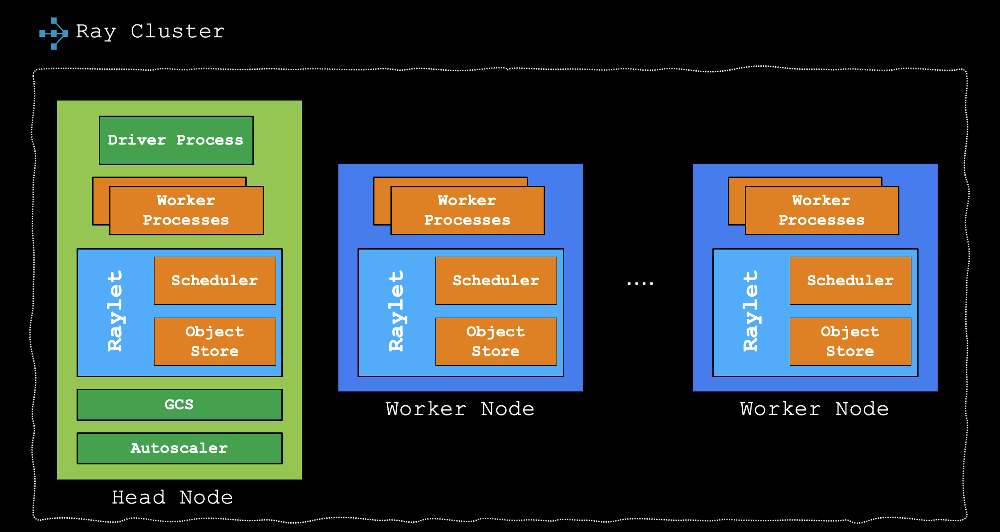
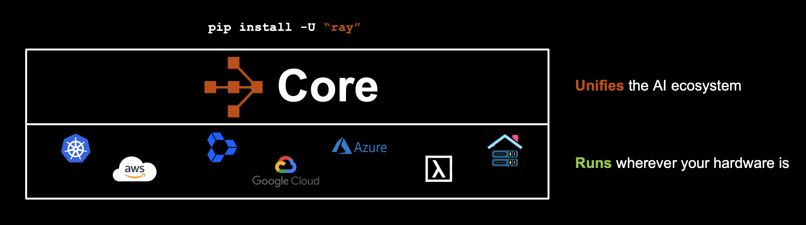
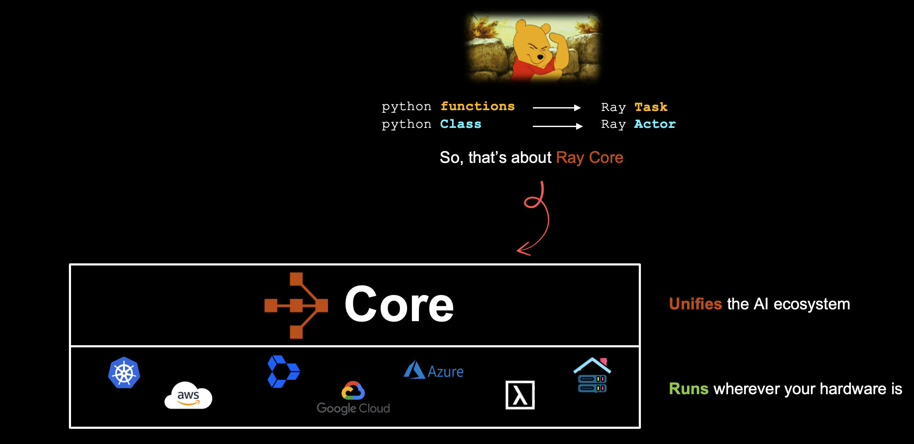
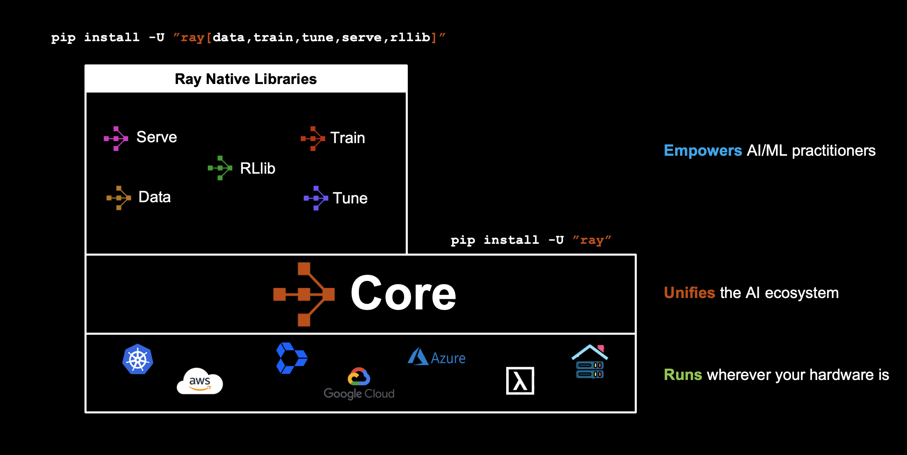
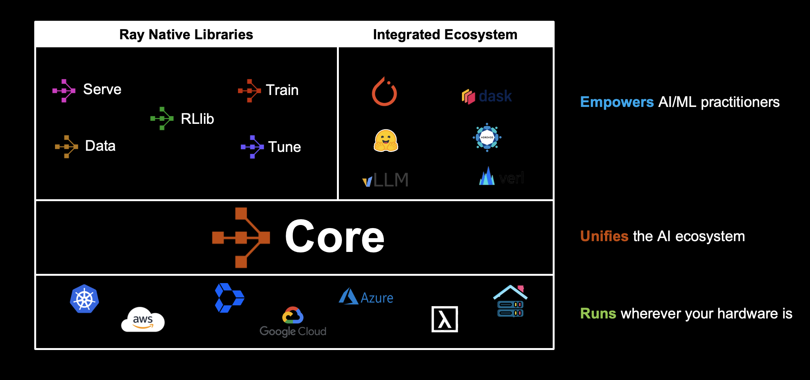
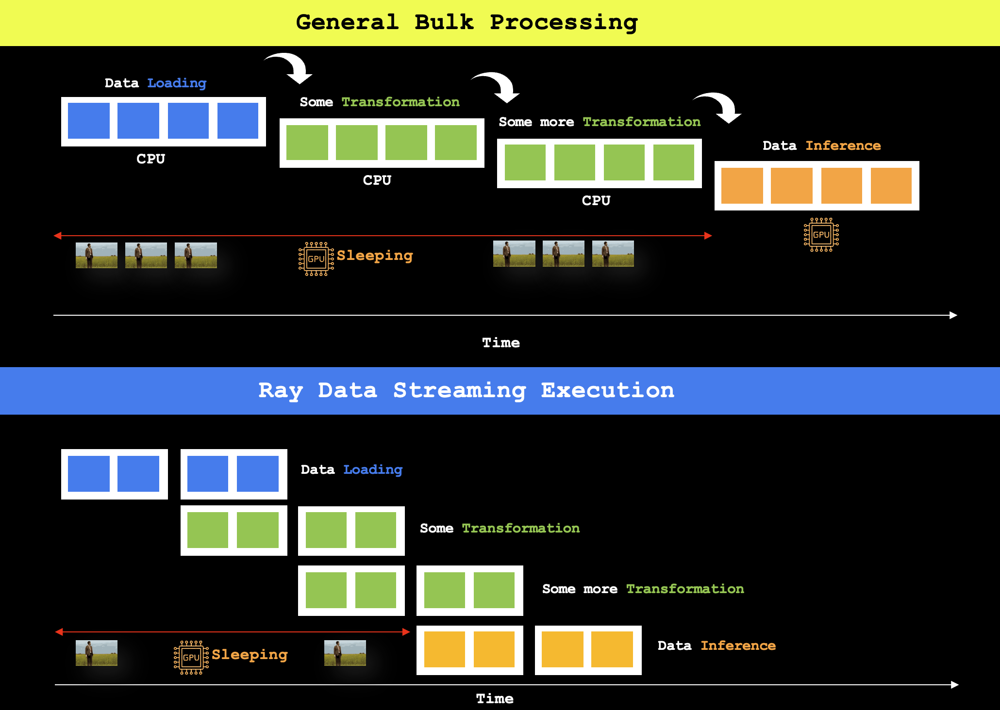

<div align="center">

# Ray for Developers

*A practical hands-on guide to building production-grade distributed applications with Ray - from distributed training and multimodal data processing to inference and reinforcement learning.*

[](https://docs.ray.io/)
[](https://www.python.org/downloads/)
[](https://pytorch.org/)
[](LICENSE)

**Topics:** `distributed-computing` `machine-learning` `deep-learning` `pytorch` `ray` `distributed-training` `ddp` `fsdp` `multimodal` `reinforcement-learning` `mlops` `data-processing` `model-serving`

</div>

---

> 🎬 **Coming Soon on [freeCodeCamp](https://www.youtube.com/@freecodecamp)!** Latest course on "Distributed AI with Ray" covering Distributed Computing, Distributed Data Processing, Distributed Training with Ray and PyTorch. Coming in Q1 2026.
>
> 📚 **Recently Published:**
> - [Distributed Training from Scratch](https://debnsuma.github.io/my-blog/posts/distributed-training-from-scratch/) - A deep dive into distributed training concepts
> - [Building Scalable AI with Ray](https://www.canva.com/design/DAG7PUwYFus/8WTEYizsfl5To_DEcLJxaA/view?utm_content=DAG7PUwYFus&utm_campaign=designshare&utm_medium=link2&utm_source=uniquelinks&utlId=he7e2dbbb1f) - Slide deck on scaling AI applications

---

## Table of Contents

- [Overview](#overview)
- [Who Is This For?](#who-is-this-for)
- [Learning Paths](#learning-paths)
  - [01. Ray Core - Distributed Computing](#01-ray-core---distributed-computing)
  - [02. Distributed Training with Ray Train](#02-distributed-training-with-ray-train)
  - [03. Multimodal Data Processing with Ray Data](#03-multimodal-data-processing-with-ray-data)
  - [04. Inference at Scale with Ray Serve](#04-inference-at-scale-with-ray-serve)
  - [05. Reinforcement Learning with Ray RLlib](#05-reinforcement-learning-with-ray-rllib)
  - [06. Projects](#06-projects)
- [Repository Structure](#repository-structure)
- [Getting Started](#getting-started)
- [Contributing](#contributing)
- [Resources](#resources)

---

## Overview

This repository provides a **practical hands-on guide** to building scalable distributed applications with Ray, a unified framework for scaling AI and Python applications. Whether you're training large language models, processing terabytes of data, or deploying ML models at scale, Ray simplifies distributed computing by abstracting away the complexity of cluster management and parallelization.


Through practical examples and production-ready code, you'll master distributed training techniques (from Data Parallel to Fully Sharded Data Parallel), learn to process multimodal datasets efficiently, deploy models for inference at scale, and implement reinforcement learning algorithms. Each module is designed to take you from fundamentals to advanced topics with real-world projects that you can adapt for your own use cases.



## Who Is This For?

- **Software engineers** exploring distributed computing and looking to scale Python applications
- **ML engineers** building scalable training pipelines and deploying models in production
- **Data scientists** working with large-scale datasets that don't fit on a single machine
- **AI researchers** implementing reinforcement learning algorithms and experimenting with distributed training
- **Anyone** looking to leverage Ray for production workloads at scale


## Learning Paths

### [01. Ray Core - Distributed Computing](./01-ray-core-distributed-computing/)

Start here if you're new to Ray. This module introduces the core concepts, architecture, and building blocks of the Ray framework. You'll understand how Ray's distributed runtime works, learn to write distributed applications using tasks and actors, and explore the object store for efficient data sharing across processes.




**What's included:**
- Notebooks covering remote functions, objects, actors, and best practices
- Bonus examples with deep dives into task lifecycle
- Exercise solutions for hands-on practice
- Helper utilities for common patterns

**Topics covered:**
- Ray architecture and cluster management
- Tasks and remote functions (`@ray.remote`)
- Actors and stateful computation
- Object store and distributed memory
- Ray Core API patterns and best practices
- Compiled graphs (experimental)



### [02. Distributed Training with Ray Train](./02-ray-train-distributed-training/)

Master distributed training for deep learning models at scale - from PyTorch DDP to FSDP.



**What's included:**
- Core notebooks covering Ray Train fundamentals, fault tolerance, and observability
- Stable Diffusion deep dive notebooks on pretraining
- Code examples for vanilla PyTorch DDP vs Ray Train comparison
- Production-ready training scripts

**Complete Learning Path:**

- **Vanilla PyTorch DDP** - Experience the complexity of manual distributed training
- **Ray Train DDP** - Learn how Ray Train eliminates 90% of boilerplate code
- **Ray Train FSDP** - Memory-efficient training for models that don't fit on a single GPU

View Slides: **[Distributed Training with Ray](https://www.canva.com/design/DAG2W25BKAw/yXl48lXeg0g60Rf_1RUXrw/view)**


*Ray Train integrates seamlessly with popular frameworks and runs on any infrastructure*

**Topics covered:**
- Data Parallel (DDP) vs Fully Sharded Data Parallel (FSDP)
- Ray Train integration with PyTorch
- Automatic resource management and fault tolerance
- Multi-node GPU training with shared storage
- Advanced FSDP configuration (CPU offload, mixed precision)
- Stable Diffusion pretraining

### [03. Multimodal Data Processing with Ray Data](./03-ray-data-multimodal-data-processing/)

Learn to process large-scale multimodal datasets efficiently with Ray Data, which provides a scalable data processing layer for ML workloads. Ray Data handles petabyte-scale datasets by distributing I/O, transformation, and preprocessing operations across cluster nodes.




**What's included:**
- Core notebooks on Ray Data fundamentals and AI workloads
- Batch inference optimization tutorials
- Multimodal search pipeline notebooks
- ETL optimization and unstructured data ingestion patterns
- Helper utilities for data processing

**Topics covered:**
- Ray Data fundamentals and API
- Batch inference optimization
- Multimodal data processing (text, images, video)
- ETL pipelines for ML training
- Streaming and batch processing
- Integration with Ray Train

View Slides: **[Building Scalable AI with Ray](https://www.canva.com/design/DAG7PUwYFus/8WTEYizsfl5To_DEcLJxaA/view?utm_content=DAG7PUwYFus&utm_campaign=designshare&utm_medium=link2&utm_source=uniquelinks&utlId=he7e2dbbb1f)**

### [04. Inference at Scale with Ray Serve](./04-ray-serve-inference-at-scale/)

Deploy and serve machine learning models at scale with Ray Serve, a scalable model serving library built on Ray. Learn to deploy models as microservices, handle high-throughput inference workloads, and implement production-grade serving patterns.

**What's included:**
- Notebooks covering architecture, autoscaling, and optimization
- Production examples (intro, app builder, autoscaling, debugging)
- Stream processing with SQS integration
- Test suite for Serve applications

**Topics covered:**
- Ray Serve architecture and deployment patterns
- Model composition and request handling
- Autoscaling configuration and load testing
- Performance optimization and batching
- Observability with Prometheus/Grafana
- Production deployment patterns

### [05. Reinforcement Learning with Ray RLlib](./05-ray-rllib-reinforcement-learning/) *(Coming Soon)*

Build and train reinforcement learning agents with RLlib, Ray's scalable reinforcement learning library. RLlib provides production-grade implementations of popular RL algorithms and scales from single machines to large clusters.

**Topics covered:**
- RLlib fundamentals and core concepts
- Policy optimization algorithms (PPO, A3C, SAC)
- Custom environments and reward shaping
- Multi-agent reinforcement learning
- Distributed RL training
- RLHF for fine-tuning language models

### 06. Projects

**[→ Explore Projects](./06-projects/)**

Complete end-to-end projects demonstrating Ray's capabilities across different domains.

**What's included:**
- **End-to-End LLMs** - Fine-tuning, data preparation, evaluation, and deployment
- **RAG (Retrieval-Augmented Generation)** - Build and deploy RAG applications
- **Ray Tune** - Hyperparameter optimization
- **Video Highlight Generator** - AI-powered video processing with Ray

[](https://www.youtube.com/watch?v=H2YptjwTEXc)

*Watch: AI-powered video highlight generation with Ray (2 min demo) - PyTorch Conf 2025*

## Repository Structure

```
ray-for-developers/
├── 01-ray-core-distributed-computing/     # Ray Core fundamentals
│   ├── notebooks/                         # Core notebooks
│   ├── bonus/                             # Additional examples
│   ├── solutions/                         # Exercise solutions
│   └── utils/                             # Helper utilities
├── 02-ray-train-distributed-training/     # Distributed training
│   ├── notebooks/                         # Ray Train notebooks
│   ├── stable-diffusion/                  # Stable Diffusion training
│   ├── 01-vanilla-pytorch-ddp/            # DDP comparison
│   ├── 02-ray-train-ddp/                  # Ray Train DDP
│   └── 03-ray-train-fsdp/                 # Ray Train FSDP
├── 03-ray-data-multimodal-data-processing/  # Data processing
│   ├── notebooks/                         # Ray Data notebooks
│   ├── batch-inference-optimization/      # Inference patterns
│   ├── multimodal-search/                 # Search pipeline
│   └── utils/                             # Helper utilities
├── 04-ray-serve-inference-at-scale/       # Model serving
│   ├── notebooks/                         # Ray Serve notebooks
│   └── examples/                          # Production examples
├── 05-ray-rllib-reinforcement-learning/   # RL (Coming Soon)
├── 06-projects/                           # End-to-end projects
│   ├── end-to-end-llms/                   # LLM workflows
│   ├── rag/                               # RAG applications
│   ├── ray-tune/                          # Hyperparameter tuning
│   └── video-highlight-generator/         # Video processing
└── imgs/                                  # Images and resources
```

## Getting Started

### Prerequisites

- **Python 3.12+** - Required for compatibility with the latest Ray and PyTorch versions
- **Ray (latest version)** - Always use the latest version of Ray for the best features and bug fixes
- **uv Package Manager** - [uv](https://github.com/astral-sh/uv) is a fast Python package installer that significantly speeds up dependency installation
- **Python Programming** - Basic understanding of Python programming and familiarity with machine learning concepts
- **PyTorch Knowledge** - Familiarity with PyTorch framework is recommended for the distributed training modules
- **GPU Hardware** - NVIDIA GPU with CUDA support is optional but recommended for accelerated training and realistic performance benchmarks

### Installation

First, install uv if you haven't already:

```bash
# On macOS and Linux
curl -LsSf https://astral.sh/uv/install.sh | sh

# On Windows
powershell -c "irm https://astral.sh/uv/install.ps1 | iex"
```

Create a virtual environment and install dependencies:

```bash
# Clone this repository
git clone https://github.com/debnsuma/ray-for-developers.git
cd ray-for-developers

# Create virtual environment with Python 3.12
uv venv --python 3.12

# Activate the virtual environment
# On macOS/Linux:
source .venv/bin/activate
# On Windows:
# .venv\Scripts\activate

# Install Ray with all components (CPU version)
uv pip install "ray[default,train,tune,serve,rllib,data]"

# Install PyTorch (CPU version)
uv pip install torch torchvision torchaudio

# For GPU support with CUDA 12.1
uv pip install torch torchvision torchaudio --index-url https://download.pytorch.org/whl/cu121
```

### Verify Installation

```bash
python -c "import ray; ray.init(); print(f'Ray version: {ray.__version__}')"
python -c "import torch; print(f'PyTorch version: {torch.__version__}'); print(f'CUDA available: {torch.cuda.is_available()}')"
```

## Contributing

Contributions are welcome and greatly appreciated! Here's how you can help improve this project:

- **Report Bugs and Issues** - If you encounter any problems or unexpected behavior, please open an issue with detailed reproduction steps
- **Suggest Features** - Have ideas for new features or improvements? Share them through GitHub issues
- **Improve Documentation** - Help make the documentation clearer, fix typos, or add examples that helped you understand concepts
- **Submit Pull Requests** - Contribute code improvements, bug fixes, or new examples

Please feel free to fork the repository and submit pull requests. For major changes, please open an issue first to discuss what you would like to change.

## Resources

**Official Ray Resources:**
- [Ray Documentation](https://docs.ray.io/) - Comprehensive official documentation for all Ray components
- [Ray Blog](https://www.anyscale.com/blog) - Technical articles, case studies, and updates from the Ray team
- [Ray Community Forum](https://discuss.ray.io/) - Ask questions and engage with the Ray community
- [Ray GitHub Repository](https://github.com/ray-project/ray) - Source code, issue tracking, and contributions

**Additional Tools:**
- [uv Documentation](https://docs.astral.sh/uv/) - Fast Python package installer used in this repository

---

## Support

If you find this repository helpful, please consider giving it a ⭐ on GitHub! It helps others discover this resource.

## License

This project is licensed under the MIT License - see the [LICENSE](LICENSE) file for details.

## Acknowledgments

- Built with [Ray](https://ray.io/) - the open-source framework for scaling AI and Python applications
- Inspired by the Ray community and the need for practical, hands-on learning resources
- Special thanks to all contributors and the open-source community

---

<div align="center">

**[⬆ Back to Top](#ray-for-developers)**

Made with ❤️ by [Suman Debnath](https://github.com/debnsuma)

</div>
